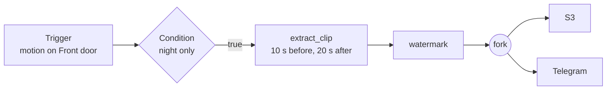

# Reeframe Backend

A lightweight, self-hosted video management system (VMS) backend in Rust. It records and relays IP cameras, and runs your own automation on what they see, without per-camera licensing.

[](https://github.com/reetmlabs/reeframe-backend/actions/workflows/ci.yml)
[](LICENSE)
[](#platforms)
[](https://www.rust-lang.org)
[](#status)

This is the backend of Reeframe. The web UI and the optional multi-site Coordinator are separate projects.

## Why Reeframe

- It's one Rust daemon with no Python, Node or GPU dependencies, built for amd64 and arm64.
- Recording and live view copy the camera's stream without decoding it. The sub stream, motion detection, thumbnails and pre-event buffers only start when a camera setting or an automation pipeline asks for them.
- Each camera is opened once. Recording, the RTSP relay, pre-event clips, snapshots and analytics all share its main and sub streams.
- Automation is built in. A pipeline like "on motion, cut a clip starting 10 s before the event and send it to Telegram" needs no glue code.
- Events come in from Home Assistant, MQTT and webhooks, among others, and results go out to S3, SFTP, email, Slack, Telegram or a webhook.
- Recording survives trouble: cameras reconnect with backoff and a circuit breaker, unfinished chunks are repaired after a crash, and recordings resume after a restart.
- It's BSD-3-Clause, with no per-camera or per-channel fees.

### Resource usage

Measured on an Intel i7-10750H with cameras streaming 1080p H.264 at 4 Mbps plus a 360p sub stream. Live view is one viewer per camera on the sub relay. CPU is the share of one core; memory is the daemon's resident size.

| Mode | 1 camera | Each extra camera |
|---|---|---|
| Idle, no cameras | 35 MB, 0% | |
| Recording | 44 MB, 1.9% | +3.4 MB, +1.9% |
| Live view | 34 MB, 1.0% | +3.7 MB, +1.1% |
| Live view and recording | 42 MB, 2.1% | +5.8 MB, +2.8% |
| + thumbnails | 112 MB, 2.1% | +12.5 MB, +2.7% |
| + motion detection | 146 MB, 3.2% | +17 MB, +5.4% |

Enabling thumbnails or motion detection loads the video decoders once, which is most of the jump for the first camera. The test streams are video noise, the hardest content to decode, so motion detection usually costs less on real footage. [docs/benchmark.md](docs/benchmark.md) describes the setup and has the scripts to reproduce it.

The release binary is 32 MB and links GStreamer from the system.

## Pipelines

A pipeline is a small graph. A trigger starts it, actions do the work, conditions and forks branch it, and transports deliver the result.



Triggers can be a schedule (cron or interval), an event from a camera or an external source, a system signal such as a camera disconnecting or a recording starting, a manual run, or a CPU, RAM or disk threshold.

The actions are `extract_clip`, `snapshot`, `start_recording`, `stop_recording`, `transcode`, `watermark`, `merge_clips`, `compress`, `encrypt`, `render_notification` and `delay`. Results can go to local disk, S3, SFTP, an SMB share mounted on the host, email, Slack, Telegram or a webhook.

Pipelines reload without a restart, and each camera only runs what its enabled pipelines need.

## Integrations

- Home Assistant events trigger Reeframe pipelines over the HA WebSocket API, and Reeframe calls back into HA automations through webhooks.
- n8n and similar workflow tools work in both directions. They start pipelines through inbound webhooks (`POST /webhooks/{id}`) or the REST API, and receive results through the webhook transport.
- MQTT, API polling and file watchers can also feed events in.
- An MCP server, so AI assistants can query cameras, recordings and events, is planned ([#14](https://github.com/reetmlabs/reeframe-backend/issues/14)).

## Features

- RTSP cameras with main and sub streams, ONVIF discovery, and credentials encrypted at rest (AES-256-GCM)
- Chunked MP4 recording with retention by age and by disk usage, and daily coverage summaries per camera time zone
- Built-in RTSP relay for live view, serving the sub stream by default
- In-memory pre-event buffer for clips that start before the event
- Optional motion, scene-change and tamper detection, and optional scrub-preview thumbnails
- Playback and export over HTTP
- Local users with JWT and API keys, or tokens issued by the Reeframe Coordinator
- SQLite by default, MySQL and PostgreSQL supported, with migrations applied on startup
- Prometheus metrics and OpenTelemetry (OTLP) tracing, plus `/health` and `/health/ready` probes

## Quick start

With Docker Compose:

```bash
git clone https://github.com/reetmlabs/reeframe-backend.git
cd reeframe-backend
export VMS_ENCRYPTION_KEY=$(openssl rand -base64 32)
export VMS_AUTH__JWT_SECRET=$(openssl rand -base64 32)
docker compose up -d --build
```

Keep both keys. The encryption key protects stored camera credentials, and changing it makes them unreadable.

The API listens on `:8080` and the RTSP relay on `:8554`. Create the first admin, then log in:

```bash
curl -X POST localhost:8080/auth/setup -H 'content-type: application/json' \
  -d '{"username":"admin","password":"change-me-please"}'
TOKEN=$(curl -s -X POST localhost:8080/auth/login -H 'content-type: application/json' \
  -d '{"username":"admin","password":"change-me-please"}' | jq -r .access_token)
```

Add a camera, record it, and get a live view URL:

```bash
CAM=$(curl -s -X POST localhost:8080/cameras -H "authorization: Bearer $TOKEN" \
  -H 'content-type: application/json' \
  -d '{"name":"Front door","rtsp_url":"rtsp://192.168.1.10/stream1","sub_rtsp_url":"rtsp://192.168.1.10/stream2","username":"admin","password":"camera-password"}' \
  | jq -r .id)
curl -X POST localhost:8080/cameras/$CAM/recording/start -H "authorization: Bearer $TOKEN"
curl -X POST localhost:8080/cameras/$CAM/relay/start -H "authorization: Bearer $TOKEN"
# {"quality":"sub","relay_url":"rtsp://<host>:8554/<camera>/sub"}
```

In Docker, `relay_url` contains the container's address; replace it with the Docker host's address to play the stream from another machine ([#15](https://github.com/reetmlabs/reeframe-backend/issues/15)).

For scripts and other services, mint a long-lived API key with `vms-daemon token generate`.

## Building from source

Requires stable Rust and GStreamer 1.20 or newer. On Debian or Ubuntu:

```bash
sudo apt install pkg-config libssl-dev \
  libgstreamer1.0-dev libgstreamer-plugins-base1.0-dev \
  libgstreamer-plugins-bad1.0-dev libgstrtspserver-1.0-dev \
  gstreamer1.0-plugins-good gstreamer1.0-plugins-bad \
  gstreamer1.0-plugins-ugly gstreamer1.0-libav

cargo build --release
VMS_ENCRYPTION_KEY=... VMS_AUTH__JWT_SECRET=... ./target/release/vms-daemon
```

## Configuration

Settings come from `/etc/reeframe/config.toml`, then `./reeframe.toml`, then environment variables prefixed `VMS_` (`__` separates sections), with later sources winning. Two keys are required:

| Variable | |
|---|---|
| `VMS_ENCRYPTION_KEY` | Base64, 32 bytes. Encrypts camera credentials at rest. |
| `VMS_AUTH__JWT_SECRET` | Base64, 32 bytes. Signs login tokens. |

Everything else has a default: the database (SQLite unless you point it at MySQL or PostgreSQL), recording directory, retention, ports and per-camera options. [docs/configuration.md](docs/configuration.md) lists every setting.

## Security

The defaults assume a trusted local network. The API is plain HTTP, and the RTSP relay on port 8554 has no authentication, so anyone who can reach it and knows a camera's ID can watch that camera. To use Reeframe from outside your network, put the API behind a TLS reverse proxy or a VPN, and keep port 8554 local. [SECURITY.md](SECURITY.md) has the full list and explains how to report a vulnerability.

## Architecture

| Crate | Role |
|---|---|
| `vms-daemon` | The binary: configuration, startup, token CLI |
| `vms-api` | REST API (Salvo) and authentication |
| `vms-engine` | Pipeline executor, trigger evaluation, resource manager, monitoring |
| `vms-media` | GStreamer pipelines: ingest, recording, relay, pre-event buffer, analytics, export |
| `vms-actions` | Pipeline action handlers |
| `vms-transports` | Delivery adapters |
| `vms-sources` | External event sources |
| `vms-db` | Database entities, migrations and repositories (SeaORM) |
| `vms-core` | Shared types |

## Platforms

Linux on amd64 and arm64, as a Docker image, a `.deb` package or a plain binary. Windows support is in progress.

## Status

Reeframe is pre-1.0, so the API and configuration can still change between releases.

## Contributing

Issues and pull requests are welcome. See [CONTRIBUTING.md](CONTRIBUTING.md).

## License

[BSD-3-Clause](LICENSE).
